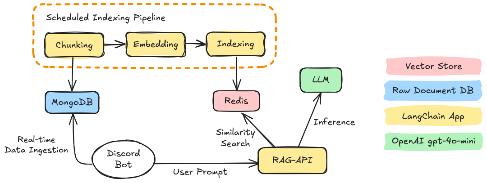

# Discord-RAG

This repo aims to provide a simple and fast way to create a RAG (Retrieval-Augmented Generation) based on your Discord messages. This allows you to use an LLM that is aware of the context of your messages and can generate responses based on that. The repo also provides code to create a Discord bot that can be used to interact with the model directly in your Discord server. Ask for old informations that were discussed long ago, make summaries, ask questions about you and your friends, have fun with the bot!

Here is a high-level overview of the architecture we are going to build:


To get started, you will need to get through the following steps:

1. [Prerequisites](#prerequisites)
2. [Export your Discord messages](#export-your-discord-messages)
3. [To do](#todo)

> [!WARNING]  
> Keep in mind that the project is in its early stages and is only a prototype for now.

## 1. Prerequisites

- A [Discord Bot Token](https://discordjs.guide/preparations/setting-up-a-bot-application.html#your-bot-s-token)
- [Docker](https://www.docker.com/) (Recommended)
- [Docker Compose](https://docs.docker.com/compose/) (Recommended)
- [Node.js](https://nodejs.org/en/) (If you don't want to use Docker)

## 2. Initial Data Ingestion


First, you will need to export the messages from your Discord server to store them elsewhere. We are going to store them in a MongoDB database.
You can either use your existing MongoDB instance or get one by using the [docker-compose.yml](./docker-compose.yml) file.

> [!IMPORTANT]  
> Don't forget to set the required environment variables in the [.env](./initial_ingestion/src/.env) file.  
> You will need the ID of the channel you want to export the messages from.  
> You can get it by right-clicking on the channel and selecting "Copy ID" in Discord (you will need to enable Developer Mode in the settings).

### Using Docker

First we start the MongoDB instance if needed:
```console
$ docker-compose up mongo -d
```

Then we start the export process:
```console
$ cd initial_ingestion
$ docker build -t initial_ingestiont_img .
$ docker run initial_ingestion_img
```

### Using npm
<details>
    <summary>Click to expand</summary>

```console
$ cd initial_ingestion
$ npm install
$ npm start
```
</details>

> [!NOTE]  
> The extraction process can take a while depending on the number of messages in the channel.  
> You can keep track of the progress by checking the logs.  
> If the process is interrupted, you can restart it and it will continue from where it left off.  
> Once the process is done, you can move on to the next step.

## TODO